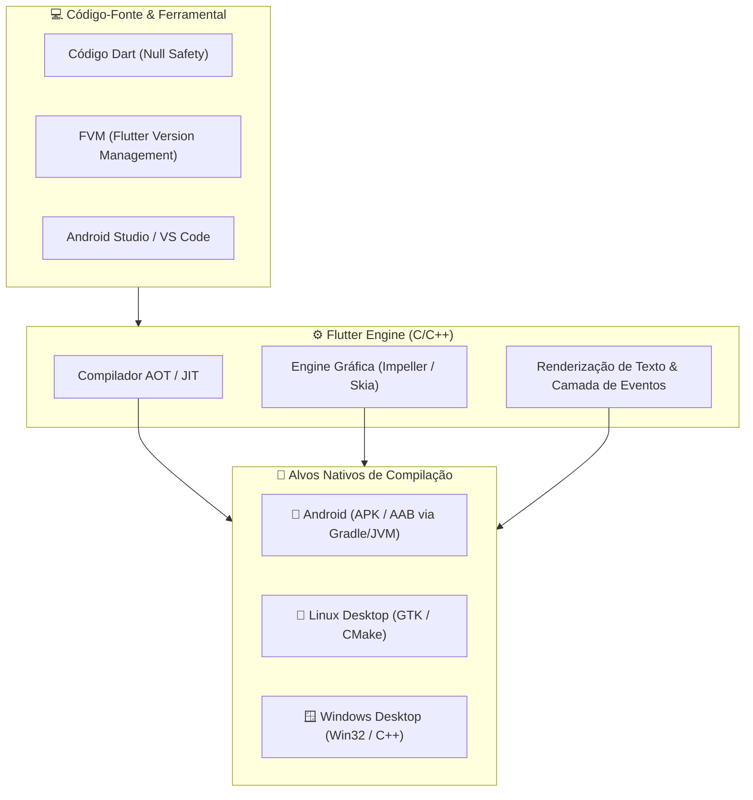

# 📱 Desenvolvimento Mobile & Fundamentos: Flutter e Dart

Repositório público de engenharia de software focado em **desenvolvimento multiplataforma** com **Flutter**, **fundamentos modernos da linguagem Dart** (com *Sound Null Safety* e programação reativa/funcional), automação de pipelines de build local e governança de ambientes no Linux e Windows.

Parte integrante da vitrine profissional de tecnologia mantida por **Bruno César** ([@brncesarms](https://github.com/brncesarms)).

---

## 🏛️ Arquitetura de Execução & Compilação Multiplataforma

O ecossistema Flutter compila o código-fonte Dart diretamente para binários nativos ARM64 e x86_64, utilizando a engine gráfica Impeller/Skia:

---

## 🛠️ 1. Pipeline de Preparação do Ambiente de Desenvolvimento

Passo a passo determinístico para provisionamento e validação da stack nos dois principais sistemas operacionais de bancada:

### 🐧 Ambiente Linux (Debian, Ubuntu e Omarchy)
- 📋 [Guia Geral de Instalação no Linux](./00_preparing_flutter_environment/flutter_linux/flutter_linux.md)
  1. [01 - Configuração de Variáveis no .bashrc](./00_preparing_flutter_environment/flutter_linux/01_bashrc_config.md)
  2. [02 - Instalação e Identidade do Git](./00_preparing_flutter_environment/flutter_linux/02_install_git.md)
  3. [03 - Java JDK e SDKMAN](./00_preparing_flutter_environment/flutter_linux/03_install_jdk.md)
  4. [04 - Android Studio e SDK Tools](./00_preparing_flutter_environment/flutter_linux/04_install_android_studio.md)
  5. [05 - Flutter SDK e Dependências C/C++](./00_preparing_flutter_environment/flutter_linux/05_install_flutter.md)
  6. [06 - FVM (Flutter Version Management)](./00_preparing_flutter_environment/flutter_linux/06_install_fvm.md)

### 🪟 Ambiente Windows (Windows 11)
- 📋 [Guia Geral de Instalação no Windows](./00_preparing_flutter_environment/flutter_windows/flutter_windows.md)
  1. [01 - Gerenciador Chocolatey](./00_preparing_flutter_environment/flutter_windows/01_install_chocolatey_win.md)
  2. [02 - Git via WinGet](./00_preparing_flutter_environment/flutter_windows/02_install_git_win.md)
  3. [03 - Java JDK e Variáveis de Sistema](./00_preparing_flutter_environment/flutter_windows/03_install_java_jdk_win.md)
  4. [04 - Android Studio e Variáveis PowerShell](./00_preparing_flutter_environment/flutter_windows/04_install_android_studio_win.md)
  5. [05 - Flutter SDK e FVM](./00_preparing_flutter_environment/flutter_windows/05_install_fvm_win.md)

---

## 📘 2. Catálogo Zettelkasten: Fundamentos de Dart

Acervo atômico categorizado cobrindo as bases essenciais da linguagem:

| Categoria | Assunto | Nota Técnica | Destaques |
|---|---|---|---|
| **Início** | Projeto | [00_create_new_project_by_terminal.md](./01_basic_dart/00_criando_projeto/00_create_new_project_by_terminal.md) | Inicialização CLI |
| **Estrutura** | Função Main | [01_funcao_main.md](./01_basic_dart/01_funcao_main/01_funcao_main.md) | Entry point da aplicação |
| **Tipagem** | Variáveis | [02_variaveis.md](./01_basic_dart/02_variaveis/02_variaveis.md) | Tipos primitivos e inferência |
| **Imutabilidade** | Modificadores | [03_const_final.md](./01_basic_dart/03_modificadores/03_const_final.md) | `const`, `final` e `late` |
| **Decisão** | Condicionais | [01_operadores_condicionais.md](./01_basic_dart/04_operadores_condicionais/01_operadores_condicionais.md) | `if`, `else if`, `else` |
| **Decisão** | Relacionais | [02_operadores_relacionais.md](./01_basic_dart/04_operadores_condicionais/02_operadores_relacionais.md) | `==`, `!=`, `<`, `>` |
| **Decisão** | Lógicos | [03_operadores_logicos.md](./01_basic_dart/04_operadores_condicionais/03_operadores_logicos.md) | `&&`, `\|\|`, `!` |
| **Decisão** | Ternário | [04_ternario.md](./01_basic_dart/04_operadores_condicionais/04_ternario.md) | Condicional inline |
| **Decisão** | Switch | [05_switchs.md](./01_basic_dart/04_operadores_condicionais/05_switchs.md) | Casos múltiplos e pattern matching |
| **Robustez** | Null Safety | [01_null_safety.md](./01_basic_dart/05_trabalhando_com_nulos/01_null_safety.md) | Tipagem segura contra null pointers |
| **Robustez** | Null-Aware | [02_null_aware_operator.md](./01_basic_dart/05_trabalhando_com_nulos/02_null_aware_operator.md) | Operadores `??` e `??=` |
| **Robustez** | Property Access | [03_conditional_property_access.md](./01_basic_dart/05_trabalhando_com_nulos/03_conditional_property_access.md) | Operador `?.` seguro |
| **Coleções** | Listas | [01_listas.md](./01_basic_dart/06_listas/01_listas.md) | Declaração e tipos genéricos |
| **Coleções** | Listas & Null | [02_listas_nullsafety.md](./01_basic_dart/06_listas/02_listas_nullsafety.md) | `List<String>?` vs `List<String?>` |
| **Coleções** | Manipulação | [03_manipulando_listas.md](./01_basic_dart/06_listas/03_manipulando_listas.md) | Métodos `add`, `remove`, `sort` |
| **Iteração** | Loops For | [01_for_forin.md](./01_basic_dart/07_loops/01_for_forin.md) | Laços `for` tradicional e `for-in` |
| **Iteração** | While | [02_while_do_while.md](./01_basic_dart/07_loops/02_while_do_while.md) | Laços pré e pós-testados |
| **Funcional** | Iterables | [03_interable.md](./01_basic_dart/07_loops/03_interable.md) | `where`, `map`, `takeWhile`, `skipWhile` |
| **Dados** | Strings | [01_manipulando_strings.md](./01_basic_dart/08_manipulacoes/01_manipulando_strings.md) | Substrings, divisão e regex |
| **Dados** | Números | [02_manipulando_numeros.md](./01_basic_dart/08_manipulacoes/02_manipulando_numeros.md) | Formatação, arredondamento e `parse` |

👉 Acesse o índice detalhado em: [🎯 Basic Dart — Mapa de Conteúdo](./01_basic_dart/README.md).

---

## 🔗 Repositórios Relacionados no Ecossistema

- 🐧 [linux](https://github.com/brncesarms/linux) — Sistema operacional base, ambiente Omarchy e virtualização.
- 🪟 [windows](https://github.com/brncesarms/windows) — Otimizações do Windows 11 e automação via PowerShell.
- 🌐 [redes](https://github.com/brncesarms/redes) — Infraestrutura, DNS local e conectividade remota.
- 🤖 [ia](https://github.com/brncesarms/ia) — Modelos locais e pipelines RAG.
- 📦 [proxmox](https://github.com/brncesarms/proxmox) — Hipervisor para VMs de teste e integração contínua.
- 🧰 [scripts](https://github.com/brncesarms/scripts) — Scripts determinísticos de automação e DevOps.

---

## 📜 Licença

Distribuído sob a licença **MIT**. Consulte `LICENSE` para mais detalhes.  
Criado e mantido por **Bruno César** ([@brncesarms](https://github.com/brncesarms)).
